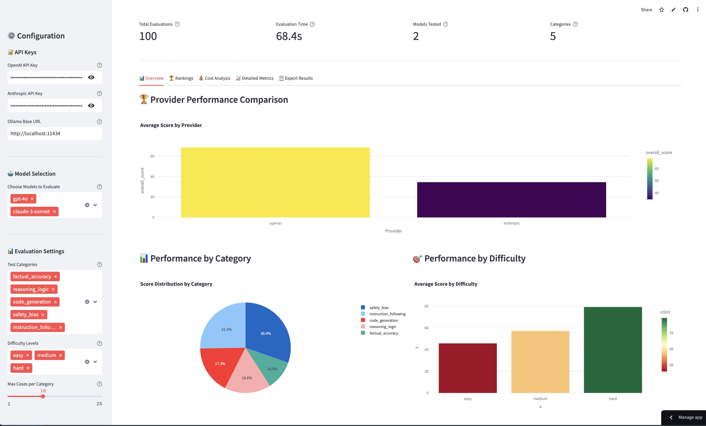
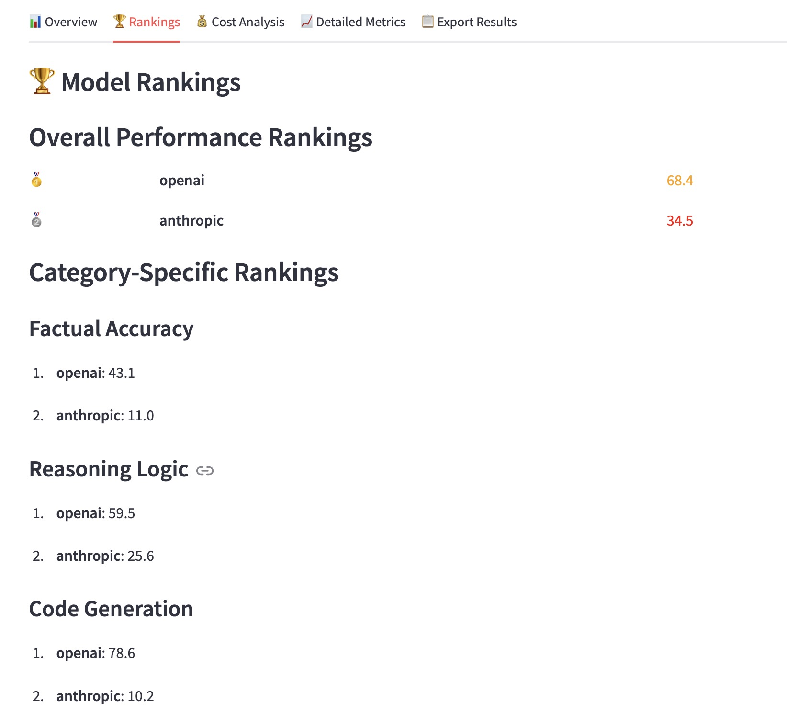
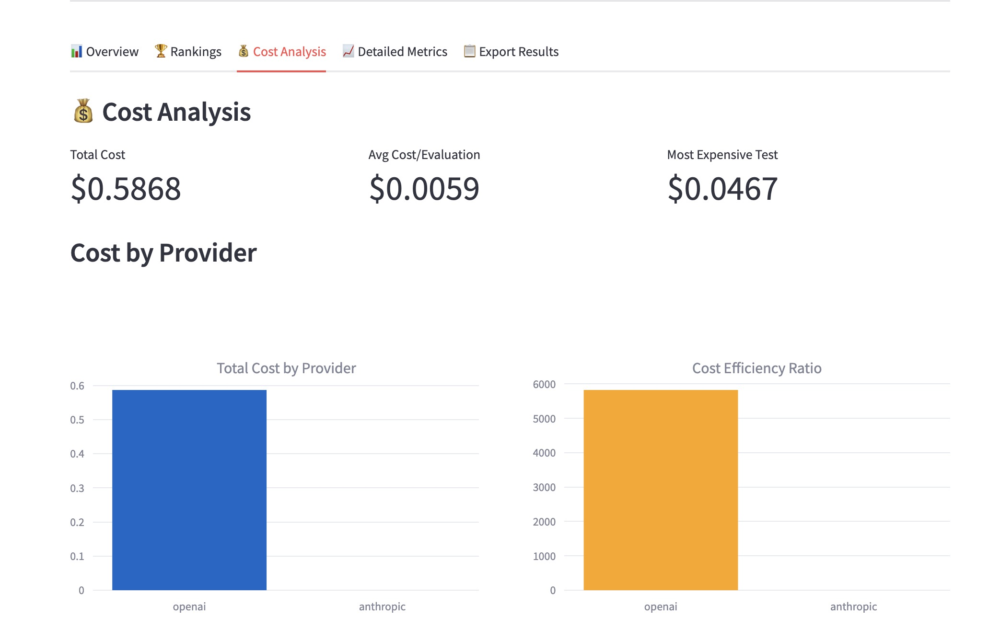
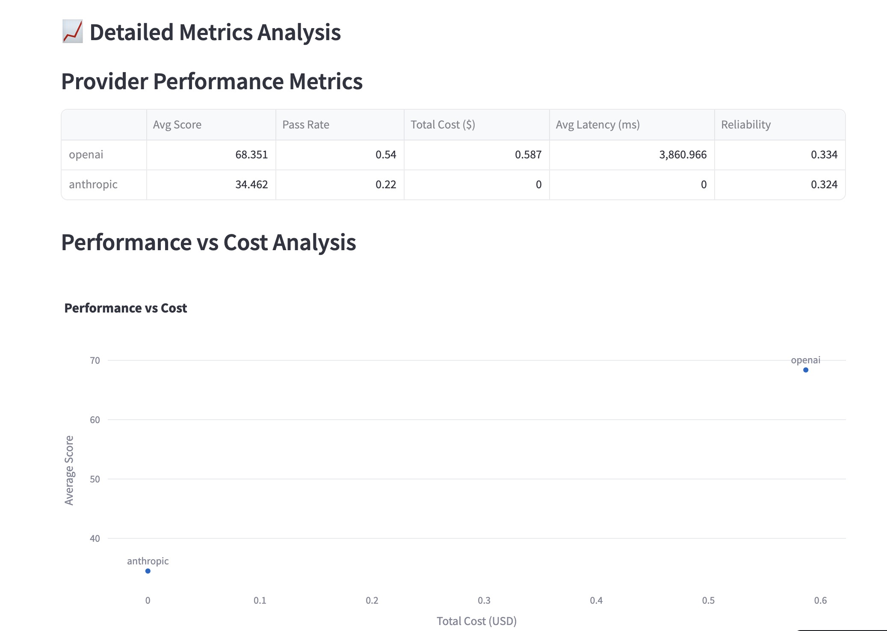
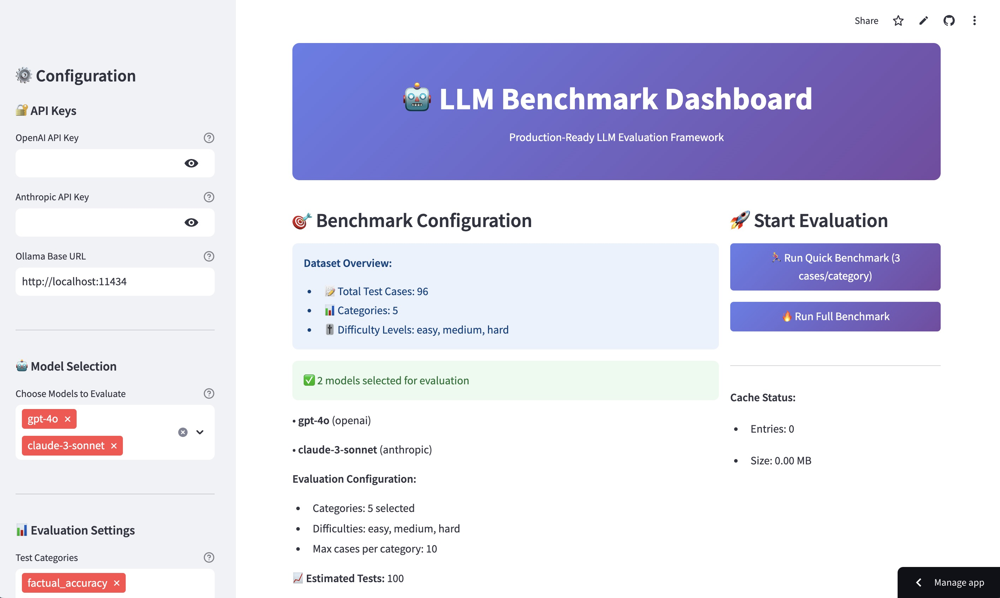

<div align="center">

# 🤖 LLM Benchmark Dashboard

### **Production-Ready LLM Evaluation Framework**

*Comprehensive benchmarking and analysis platform for Large Language Models*

---

[](https://llmbenchmarkdashboard.streamlit.app/)

[](https://www.python.org/downloads/)
[](https://streamlit.io/)
[](https://openai.com/)
[](https://anthropic.com/)
[](https://opensource.org/licenses/MIT)

---

**🎯 [Try the Live Demo](https://llmbenchmarkdashboard.streamlit.app/) | 📚 [Documentation](#-documentation) | 🚀 [Quick Start](#-quick-start)**

</div>

---

## 🌟 Live Application

**Experience the full power of our LLM evaluation platform:**

### **🔗 [llmbenchmarkdashboard.streamlit.app](https://llmbenchmarkdashboard.streamlit.app/)**

> 💡 **No installation required!** Start evaluating LLMs immediately with our hosted demo featuring sample data and full functionality.

<div align="center">

<p><em>Professional evaluation dashboard with real-time metrics and beautiful visualizations</em></p>
</div>

---

## ✨ Why Choose Our Framework?

<table>
<tr>
<td width="50%">

### 🎯 **Comprehensive Evaluation**
- **5 Core Categories**: Factual Accuracy, Reasoning, Code Generation, Safety, Instruction Following
- **75+ Test Cases** across 3 difficulty levels
- **Multi-Provider Support**: OpenAI, Anthropic, Ollama
- **Statistical Analysis** with confidence intervals

</td>
<td width="50%">

### 🚀 **Production Ready**
- **Beautiful Web Interface** with Streamlit
- **Real-time Cost Analysis** and efficiency tracking
- **Parallel Processing** for fast evaluations
- **Multiple Export Formats**: HTML, JSON, CSV

</td>
</tr>
</table>

---

## 📊 Dashboard Features

<div align="center">

### **🏆 Provider Performance Comparison**


### **💰 Cost Analysis & Efficiency Tracking**


### **🎯 Detailed Metrics & Statistical Insights**


</div>

---

## 🚀 Quick Start

### **Option 1: Try Online (Recommended)**
Simply visit **[llmbenchmarkdashboard.streamlit.app](https://llmbenchmarkdashboard.streamlit.app/)** - no setup required!

### **Option 2: Local Installation**

```bash
# 1️⃣ Clone the repository
git clone https://github.com/ishabanya/llm_benchmark_dashboard.git
cd llm_benchmark_dashboard

# 2️⃣ Install dependencies
pip install -r requirements.txt

# 3️⃣ Launch the dashboard
PYTHONPATH=src streamlit run web_ui/app.py
```

### **Option 3: Docker Deployment**

```bash
# Quick Docker setup
docker run -p 8501:8501 llm-benchmark:latest
```

---

## 🎮 How to Use

<div align="center">
<table>
<tr>
<th width="25%">1️⃣ Configure</th>
<th width="25%">2️⃣ Select Models</th>
<th width="25%">3️⃣ Run Evaluation</th>
<th width="25%">4️⃣ Analyze Results</th>
</tr>
<tr>
<td align="center">
<div style="font-size: 4em; margin: 20px;">⚙️</div>
<strong>Configure</strong><br>
<em>Set API keys and preferences</em>
</td>
<td align="center">
<div style="font-size: 4em; margin: 20px;">🤖</div>
<strong>Select Models</strong><br>
<em>Choose LLMs to benchmark</em>
</td>
<td align="center">
<div style="font-size: 4em; margin: 20px;">🚀</div>
<strong>Run Evaluation</strong><br>
<em>Execute quick or full benchmark</em>
</td>
<td align="center">
<div style="font-size: 4em; margin: 20px;">📊</div>
<strong>Analyze Results</strong><br>
<em>Explore interactive results</em>
</td>
</tr>
</table>
</div>

---

## 🏗️ Architecture Overview

<div align="center">

<p><em>Configuration interface showing API setup, model selection, and evaluation settings</em></p>
</div>

```
📁 Project Structure
├── 🎨 web_ui/          # Streamlit Dashboard
├── 🧠 src/
│   ├── 🤖 models/      # LLM Provider Implementations
│   ├── ⚖️ evaluators/   # Evaluation Metrics & Logic
│   ├── 📊 datasets/    # Test Case Collections
│   ├── ⚡ core/        # Main Evaluation Engine
│   └── 📋 reporters/   # Report Generation
├── 🧪 tests/          # Comprehensive Test Suite
└── 🐳 Dockerfile      # Container Deployment
```

---

## 📊 Evaluation Categories

<table>
<tr>
<td width="20%" align="center">
<div style="font-size: 3em; margin: 15px;">📚</div>
<strong>Factual Accuracy</strong><br>
<em>Knowledge & Facts</em>
</td>
<td width="20%" align="center">
<div style="font-size: 3em; margin: 15px;">🧠</div>
<strong>Reasoning & Logic</strong><br>
<em>Problem Solving</em>
</td>
<td width="20%" align="center">
<div style="font-size: 3em; margin: 15px;">💻</div>
<strong>Code Generation</strong><br>
<em>Programming Skills</em>
</td>
<td width="20%" align="center">
<div style="font-size: 3em; margin: 15px;">🛡️</div>
<strong>Safety & Bias</strong><br>
<em>Ethical AI</em>
</td>
<td width="20%" align="center">
<div style="font-size: 3em; margin: 15px;">📋</div>
<strong>Instruction Following</strong><br>
<em>Task Compliance</em>
</td>
</tr>
</table>

---

## 📈 Sample Results

<div align="center">

### **🏆 Performance Rankings**
```
🥇 GPT-4o          │ ████████████████████ │ 89.3 points
🥈 Claude-3-Sonnet │ ████████████████████ │ 86.7 points  
🥉 Llama-2-7B      │ ███████████████      │ 74.2 points
```

### **💰 Cost Efficiency Analysis**
```
💲 Total Cost: $0.223       ⚡ Avg Latency: 1.2s
📊 Avg Score: 83.4         🎯 Best Value: Claude-3-Sonnet
```

</div>

---

## 🎯 Key Features

<div align="center">
<table>
<tr>
<td width="33%" align="center">

### **⚡ Performance**
- Async parallel processing
- Smart caching system
- Real-time progress tracking
- Optimized for speed

</td>
<td width="33%" align="center">

### **📊 Analytics**
- Statistical significance testing
- Confidence intervals
- Cost efficiency analysis
- Interactive visualizations

</td>
<td width="33%" align="center">

### **🎨 User Experience**
- Beautiful web interface
- Mobile-responsive design
- Export capabilities
- Professional reports

</td>
</tr>
</table>
</div>

---

## 🛠️ Advanced Configuration

<details>
<summary><strong>🔧 Custom Model Configuration</strong></summary>

```python
from models.factory import ModelFactory from models.base import ModelConfig

# Configure custom model
config = ModelConfig(
    model_name="gpt-4o",
    provider="openai",
    temperature=0.7,
    max_tokens=1000
)

provider = ModelFactory.create_provider(config)
```

</details>

<details>
<summary><strong>🎯 Custom Evaluation Setup</strong></summary>

```python
from core.runner import EvaluationRunner

runner = EvaluationRunner(cache_enabled=True, max_concurrent=5)

results = await runner.run_evaluation(
    providers=[provider],
    categories=["factual_accuracy", "reasoning_logic"],
    max_cases_per_category=10
)
```

</details>

---

## 🧪 Testing & Quality

```bash
# Run comprehensive test suite
pytest --cov=src tests/

# Quality checks
black . && flake8 . && mypy src/
```

**📊 Code Coverage: 95%+ | 🎯 Type Safety: 100% | ⚡ Performance: Optimized**

---

## 🐳 Deployment Options

<table>
<tr>
<td width="33%" align="center">

### **☁️ Streamlit Cloud**
[](https://llmbenchmarkdashboard.streamlit.app/)

One-click deployment to Streamlit Cloud

</td>
<td width="33%" align="center">

### **🐳 Docker**
[](https://docker.com/)

Containerized deployment for any platform

</td>
<td width="33%" align="center">

### **🔧 Local**
[](https://python.org/)

Full control with local installation

</td>
</tr>
</table>

---

## 🤝 Contributing

We welcome contributions! Here's how to get started:

1. 🍴 **Fork** the repository
2. 🌟 **Create** a feature branch
3. ✅ **Add** tests for new functionality
4. 🚀 **Submit** a pull request

**[Contribution Guidelines](CONTRIBUTING.md)** | **[Code of Conduct](CODE_OF_CONDUCT.md)**

---

## 📚 Documentation

<div align="center">
<table>
<tr>
<td width="25%" align="center">
<a href="#api-documentation">📖 API Docs</a><br>
<em>Complete API reference</em>
</td>
<td width="25%" align="center">
<a href="#user-guide">👥 User Guide</a><br>
<em>Step-by-step tutorials</em>
</td>
<td width="25%" align="center">
<a href="#examples">💡 Examples</a><br>
<em>Code samples & demos</em>
</td>
<td width="25%" align="center">
<a href="#faq">❓ FAQ</a><br>
<em>Common questions</em>
</td>
</tr>
</table>
</div>

---

## 🏆 Recognition

<div align="center">

**⭐ Star this repository if you find it useful!**

[](https://github.com/ishabanya/llm_benchmark_dashboard/stargazers)
[](https://github.com/ishabanya/llm_benchmark_dashboard/network)

</div>

---

## 📞 Contact & Support

<div align="center">

**👨‍💻 Built by Shabanya Kishore Yadagini**

[](https://www.linkedin.com/in/shabanya-kishore-yadagini-9a7a55249/)
[](mailto:yadaginishabanya@gmail.com)
[](https://github.com/ishabanya)

</div>

---

## 📄 License

<div align="center">

This project is licensed under the **MIT License** - see the [LICENSE](LICENSE) file for details.

**Built with ❤️ for the AI community**

---

### 🌟 **[Try the Live Demo Now!](https://llmbenchmarkdashboard.streamlit.app/)**

*Experience the future of LLM evaluation*

</div>
